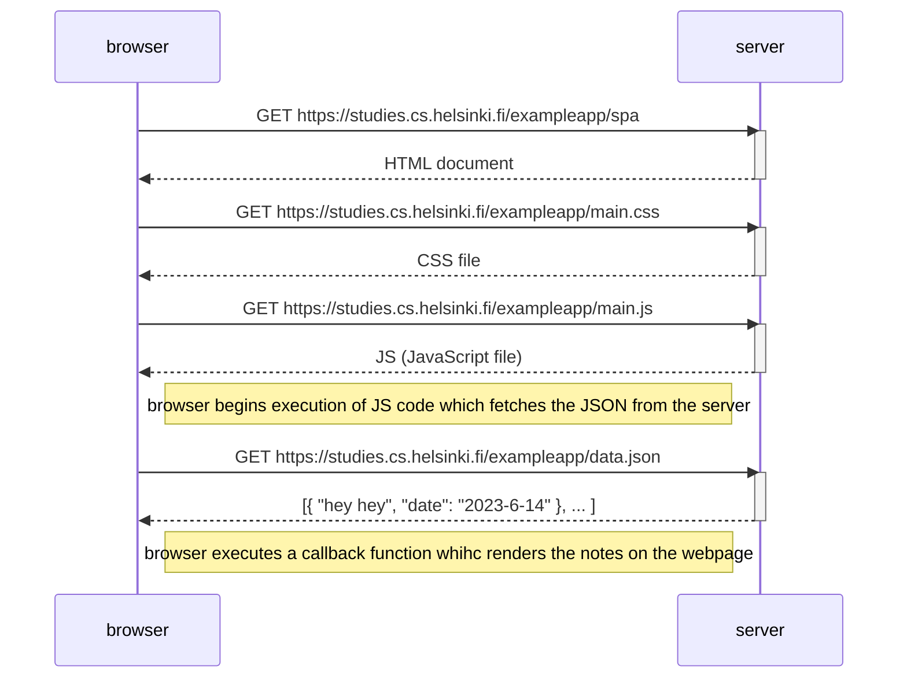

```mermaid

sequenceDiagram

    participant browser
    participant server

    browser->>server: GET https://studies.cs.helsinki.fi/exampleapp/spa
    activate server

    server-->>browser: HTML document
    deactivate server

    browser->>server: GET https://studies.cs.helsinki.fi/exampleapp/main.css
    activate server

    server-->>browser: CSS file
    deactivate server

    browser->>server: GET https://studies.cs.helsinki.fi/exampleapp/main.js
    activate server
    server-->>browser: JS (JavaScript file)
    deactivate server

    Note right of browser: browser begins execution of JS code which fetches the JSON from the server

    browser->>server: GET https://studies.cs.helsinki.fi/exampleapp/data.json
    activate server

    server-->>browser: [{ "hey hey", "date": "2023-6-14" }, ... ]
    deactivate server

    Note right of browser: browser executes a callback function whihc renders the notes on the webpage
```